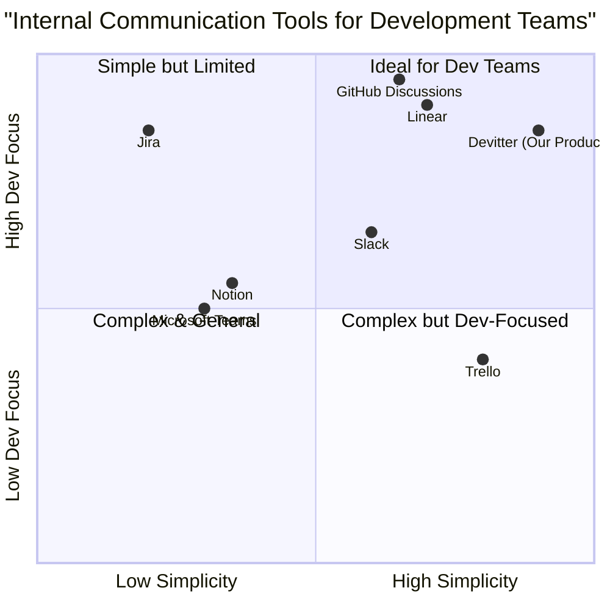

# Product Requirements Document: Devitter

## Project Information
**Project Name:** Devitter
**Date:** 2025-03-24
**Author:** Emma, Product Manager

## Original Requirements
Create a project similar to Twitter but focused on internal work tracking and information sharing for a software development company. The platform should have a timeline where team members can share updates about what they're working on, challenges/blockers they're facing, and ideas. The main goal is to prevent complexity often found in tools like Jira or Notion, which can be difficult to keep organized.

## 1. Product Definition

### 1.1 Product Vision
Devitter is an internal communication platform designed specifically for software development teams that prioritizes simplicity and effectiveness, enabling transparent work tracking and knowledge sharing without the overhead of complex project management systems.

### 1.2 Product Goals
1. **Simplify Internal Communication**: Create a streamlined platform that requires minimal training and setup while effectively facilitating team information sharing.
2. **Increase Work Visibility**: Enable team members to easily share and track progress, challenges, and ideas across the organization in a chronological timeline.
3. **Enhance Team Collaboration**: Foster a culture of knowledge sharing and problem-solving through accessible communication channels without the complexity of traditional project management tools.
4. **Boost Productivity**: Reduce time spent on status meetings and create a single source of truth for team updates.
5. **Provide Actionable Insights**: Surface patterns in work progress and blockers to help teams identify process improvements.

### 1.3 User Stories

1. **As a developer**, I want to quickly post updates about my current tasks so that my team knows what I'm working on without scheduling additional meetings.
2. **As a team lead**, I want to see a timeline of all team activities and blockers so that I can identify issues early and provide necessary support.
3. **As a product manager**, I want to share product updates and gather feedback from the development team so that we can iterate effectively.
4. **As a new team member**, I want to browse through past updates and discussions so that I can get up to speed with ongoing projects and team dynamics.
5. **As an engineering manager**, I want to identify recurring challenges across teams so that we can implement systemic solutions to common problems.
6. **As a developer**, I want automated status updates from my Git commits and PRs so I don't have to manually post routine updates.
7. **As a team member**, I want to quickly find relevant past discussions about specific features or issues without digging through multiple tools.
8. **As a remote worker**, I want to stay connected with team progress and challenges without overwhelming message notifications.

### 1.4 Competitive Analysis

| Product | Pros | Cons |
|---------|------|------|
| **Slack** | Rich integrations with dev tools; Organized channels; Good search functionality | Can become noisy; Information gets buried; Not focused on work tracking |
| **Microsoft Teams** | Comprehensive collaboration features; Office 365 integration | Complex interface; Overwhelming feature set; High resource usage |
| **Jira** | Detailed task tracking; Robust workflow customization | Steep learning curve; Complex setup; Excessive features for simple needs |
| **Notion** | Highly flexible; Good documentation capabilities | Requires significant setup; "Blank canvas paralysis"; Can become disorganized |
| **Linear** | Clean interface; Fast performance; Developer-focused | Less flexible for non-technical teams; Limited customization options |
| **Trello** | Visual boards; Easy to use | Limited for complex project tracking; Lacks developer-specific features |
| **GitHub Discussions** | Direct integration with code; Developer-familiar | Limited to GitHub users; Not designed for general updates |

### 1.5 Competitive Quadrant Chart



## 2. Technical Specifications

### 2.1 Requirements Analysis

Devitter must provide a streamlined communication platform with a focus on simplicity and effectiveness for software development teams. The core of the platform will be a timeline-based feed where users can post updates about their work, challenges, and ideas. The platform should avoid the complexity of traditional project management tools while still providing enough structure to organize information effectively.

Key areas of focus:

1. **Simple User Experience**: The platform must be intuitive with minimal learning curve and focused on developer workflows
2. **Timeline-Based Feed**: A chronological view of updates from team members with smart filtering options
3. **Categorization System**: Simple way to categorize posts without complex hierarchies
4. **Search & Filter**: Powerful but easy-to-use retrieval of past information
5. **Dev-Tool Integration**: Seamless connection with common development tools with automated updates
6. **Notification System**: Smart notifications that highlight important updates without overwhelming users
7. **User Profiles**: Simple profiles showing areas of expertise, current focus, and contribution trends
8. **Productivity Insights**: Lightweight analytics to help identify bottlenecks and improve team processes

### 2.2 Requirements Pool

#### P0 (Must Have)
- A timeline feed showing posts from all team members in chronological order
- Ability to create posts with different categories (Update, Blocker, Idea, Question)
- User profiles with basic information (name, role, team, current focus)
- Simple tagging system for topics/projects
- Basic search functionality to find past posts
- Ability to comment on and react to posts
- Web-based responsive interface accessible on desktop and mobile devices
- User authentication and basic permission system
- GitHub integration to automatically post updates from commits and PRs
- @mentions to notify specific team members
- Filter system to view posts by category, user, team, or tag
- Bookmark important posts for later reference

#### P1 (Should Have)
- Smart digest of daily activity (personalized based on team/interests)
- Quick-reply templates for common responses
- Simple analytics dashboard showing team activity and trends
- Notification preferences with smart filtering options
- Dark/light mode toggle
- Thread-based discussions for longer conversations
- "Focus mode" that shows only high-priority items relevant to the user
- Simple keyboard shortcuts for power users
- Rich text formatting and code snippet support with syntax highlighting

#### P2 (Nice to Have)
- Additional integrations with Slack, Linear, Jira, etc.
- Advanced search with filters and saved searches
- AI-powered summary of key discussions and decisions
- Custom views and dashboard creation
- Private team spaces within the platform
- Automated status updates from integrated systems
- Topic clustering and trend identification
- Voice notes for quick updates
- Calendar integration to display team availability

### 2.3 UI Design Draft

#### Main Feed Page
```
+-----------------------------------------------------+
|  DEVITTER                          [Profile] [Search] |
+-----------------------------------------------------+
|                                                     |
|  + Create New Post                                  |
|                                                     |
|  FILTERS: All | Updates | Blockers | Ideas | Questions|
|  TEAMS: [All ▼]  TRENDING: #api-refactor #release-v2 |
|                                                     |
|  +---------------------------------------------------+
|  | Jane Doe (Frontend) • 10m ago • [UPDATE] #login-page|
|  |                                                   |
|  | Completed the responsive design for the login form.|
|  | Moving on to registration page now.               |
|  |                                                   |
|  | [Comment] [React: 👍 5 🎉 2] [Bookmark]          |
|  +---------------------------------------------------+
|                                                     |
|  +---------------------------------------------------+
|  | John Smith (Backend) • 1h ago • [BLOCKER] #api   |
|  |                                                   |
|  | Having issues with the authentication service.    |
|  | Getting timeout errors when connecting to the DB. |
|  | @DevOps Any ideas?                               |
|  |                                                   |
|  | [Comment: 3] [React: 👀 2] [Priority: High]      |
|  +---------------------------------------------------+
|                                                     |
|  +---------------------------------------------------+
|  | GitHub • 2h ago • [PR] #performance              |
|  |                                                   |
|  | Alex Wong opened PR #143: "Implement caching     |
|  | layer for user data"                             |
|  | +3 commits • 5 files changed                     |
|  |                                                   |
|  | [View PR] [Comment: 2] [React: 👍 3]             |
|  +---------------------------------------------------+
|                                                     |
|  +---------------------------------------------------+
|  | Alex Wong (PM) • 3h ago • [IDEA] #performance    |
|  |                                                   |
|  | What if we implement a caching layer for the most |
|  | frequently accessed user data? Could improve     |
|  | dashboard loading times significantly.           |
|  |                                                   |
|  | [Comment: 7] [React: 💡 10 👍 8]                  |
|  +---------------------------------------------------+
|                                                     |
```

#### Create Post Modal
```
+-----------------------------------------------------+
|  Create New Post                             [Close] |
+-----------------------------------------------------+
|                                                     |
|  Post Type: [UPDATE ▼]                              |
|                                                     |
|  Tags: [#frontend #login-page                     ] |
|                                                     |
|  Message:                                           |
|  [                                               ] |
|  [                                               ] |
|  [                                               ] |
|                                                     |
|  Mention: [@someone                              ] |
|                                                     |
|  Priority: [Normal ▼]                               |
|                                                     |
|  [Attach Link/File] [Add Code Snippet]              |
|                                                     |
|  [Cancel]                           [Post Update]   |
+-----------------------------------------------------+
```

#### User Profile Page
```
+-----------------------------------------------------+
|  DEVITTER                          [Profile] [Search] |
+-----------------------------------------------------+
|                                                     |
|  [Profile Image]  Jane Doe                          |
|  Frontend Developer                                 |
|  UI Team                                            |
|                                                     |
|  Current Focus: Login/Registration Flow             |
|  Expertise: React, CSS, Accessibility               |
|                                                     |
|  Activity Stats:                                    |
|  - Posts this week: 15                              |
|  - Comments: 23                                     |
|  - Most active on: #login-page #ui-components       |
|  - Helping others: 8 blocker responses              |
|                                                     |
|  RECENT ACTIVITY:                                   |
|  +---------------------------------------------------+
|  | Jane Doe • 10m ago • [UPDATE] #login-page        |
|  | Completed the responsive design for the login... |
|  +---------------------------------------------------+
|  +---------------------------------------------------+
|  | Jane Doe • Yesterday • [IDEA] #accessibility     |
|  | We should consider adding keyboard shortcuts... |
|  +---------------------------------------------------+
|                                                     |
```

#### Team Dashboard
```
+-----------------------------------------------------+
|  DEVITTER                          [Profile] [Search] |
+-----------------------------------------------------+
|                                                     |
|  TEAM DASHBOARD: Frontend Team                      |
|                                                     |
|  ACTIVE MEMBERS (5/5):                              |
|  [Jane] [Miguel] [Sara] [David] [Kim]               |
|                                                     |
|  CURRENT SPRINT ACTIVITY:                           |
|  - Updates: 32 (+15% from last sprint)              |
|  - Blockers: 7 (-3 from last sprint)                |
|  - Ideas: 12                                        |
|  - Questions: 18                                    |
|                                                     |
|  TOP DISCUSSIONS:                                   |
|  1. Authentication flow redesign (15 comments)      |
|  2. Mobile responsive issues (9 comments)           |
|  3. Accessibility improvements (8 comments)         |
|                                                     |
|  RECENT BLOCKERS:                                   |
|  [View List]                                        |
|                                                     |
|  TEAM MOOD: 😊 Overall positive                     |
|                                                     |
```

### 2.4 Open Questions

1. **Integration Depth**: How deeply should we integrate with development tools like GitHub, Jira, etc.? Should we focus on a few key integrations first or try to be comprehensive?

2. **Archiving Policy**: Should old posts automatically archive after a certain time period? How do we balance keeping a clean feed with preserving institutional knowledge?

3. **Private vs. Public**: Should we allow private messages or posts visible only to specific teams, or keep everything transparent across the organization?

4. **Metrics**: What metrics should we track to measure the success of the platform? User engagement, information discovery efficiency, reduction in meetings?

5. **User Onboarding**: What is the minimum viable onboarding process for new users to start contributing effectively?

6. **Mobile Strategy**: Should we prioritize a responsive web design or develop native mobile apps?

7. **Notification Balancing**: How do we ensure users get important notifications without causing notification fatigue?

8. **AI Integration**: How much should we leverage AI for generating insights and summaries without adding complexity?

9. **Sprint Integration**: Should we integrate with sprint cycles to provide context to posts and updates?

## 3. Implementation Considerations

### 3.1 Technology Stack

#### Frontend
- React for the user interface
- Tailwind CSS for styling
- Redux for state management
- Socket.io for real-time updates

#### Backend
- Node.js with Express
- MongoDB for the database
- Redis for caching and real-time features
- JWT for authentication

#### DevOps
- Docker containers
- CI/CD pipeline with GitHub Actions
- Cloud hosting (AWS or similar)
- Monitoring with Prometheus and Grafana

### 3.2 Development Phases

#### Phase 1 (MVP - 6 weeks)
- Basic user authentication
- Timeline feed implementation
- Post creation with categories
- Comments and reactions
- Simple user profiles
- Basic search functionality
- GitHub integration for automated updates
- Simple filter system

#### Phase 2 (4 weeks)
- Tagging system
- @mentions functionality
- Improved GitHub integration
- Enhanced filter system
- Improved search with trending topics
- Team dashboard with basic analytics
- Bookmarking feature
- Dark/light mode

#### Phase 3 (4 weeks)
- Additional integrations (Slack, etc.)
- Analytics dashboard
- Email/notification digests
- Custom views
- Priority indicators for posts
- Mobile responsive improvements

### 3.3 Success Metrics

1. **User Engagement**
   - Daily Active Users (>90% of team)
   - Posts per user per week (>5)
   - Comments and reactions per post (>3)
   - Reduction in tool-switching time (measured via surveys)

2. **Information Efficiency**
   - Reduction in status update meetings (target: 50%)
   - Time to find relevant information (target: <30 seconds)
   - Cross-team awareness (measured via surveys)
   - Percentage of automated vs. manual updates (target: 30% automated)

3. **Problem Resolution**
   - Time to identify and address blockers (target: 30% reduction)
   - Number of resolved issues through platform collaboration
   - Team satisfaction with communication flow (measured via surveys)

## 4. Go-to-Market Strategy

### 4.1 Internal Launch Plan

1. **Pilot Phase (1 week)**
   - Select one team to test the platform
   - Collect feedback and make quick adjustments

2. **Company Rollout (2 weeks)**
   - Department by department adoption
   - Champions in each team to encourage usage
   - Daily tips and best practices shared
   - Quick-start competitions to encourage adoption

3. **Full Adoption (ongoing)**
   - Integration into company workflows
   - Regular feedback collection and improvements
   - Success stories and use case sharing
   - Monthly metric reviews to ensure value delivery

### 4.2 Training Materials

- Quick start guide (3 minutes or less)
- Short video tutorials for key features (30-60 seconds each)
- Integration guides for connecting with existing tools
- Best practices documentation
- Templates for different types of updates
- Slack bot reminders and tips

## 5. Conclusion

Devitter aims to solve the communication challenges faced by software development teams by providing a simple yet effective platform for sharing work updates, challenges, and ideas. By focusing on simplicity and avoiding the complexity pitfalls of tools like Jira and Notion, Devitter can become an integral part of a development team's daily workflow.

The timeline-based approach, inspired by Twitter's original purpose as an internal communication tool, provides a familiar paradigm that requires minimal training while still offering powerful capabilities for information sharing and discovery. By carefully implementing the requirements outlined in this document and addressing the open questions through user research and testing, Devitter can deliver substantial value to software development teams of all sizes.

Key differentiators for Devitter:
1. **Simplicity First**: Clean UI with minimal cognitive load
2. **Developer-Centric**: Designed specifically for software team workflows
3. **Automated Updates**: Reduces manual reporting through dev tool integrations
4. **Insight Generation**: Surfaces patterns to improve team productivity
5. **Fast Adoption**: Minimal training required with familiar social media paradigms

This approach will create a platform that teams actually want to use, rather than one they feel obligated to use, driving natural adoption and sustainable productivity improvements.